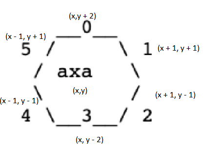
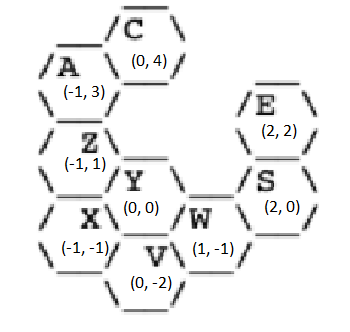
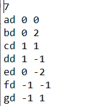
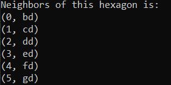

# Kill The Covid Developer Guide

The idea behind my implementation for the solution is to create data based on coordinates of hexagons, which will be further elaborated, and its own name. Once the hexagons are all created. 

There are 4 operations that can be done for the current version of the program: `query` (asking for neighbors of a hexagon), `add` (add a hexagon with its neighbor being known), `remove` (delete a hexagon and check whether it is appropriate to delete or not), and `exit` (terminate the program)

## 1. Getting started

First of all, please make sure that C++ compiler (g++) and Git bash is installed in your computer.

To clone this repository, please use the following command on Git bash:

`git clone https://github.com/thanhduc2000/kill_the_covid`

To be updated with the newest changes, you can use:

`git pull origin master`

To be able to compile the program, you can try to open a C++ IDE or a terminal by trying to access the src folder and use:

`g++ -o main main.cpp`

to produce the executable file. You can try to test the program's behavior using some of the inputs given

`./main < ../test/inputX.txt`

where X is the index of an input file.

## 2. Construction of the solution

The diagram above is an illustration of how the hexagons will be denoted in my system. Let the source hexagon's coordinate be (x,y) then the surrounding (neighbors) of this hexagon is shown above. The idea above can used to check the neighbors of this hexagon using the difference between the x-coordinates and y-coordinates and also for adding diagram.

This is another illustration of how the coordinates are numbered.

For the `remove` operations, I will be using BFS traversing for finding the connection of the neighbors of the removed hexagon to decide that the specified hexagon should be removed or not.

## 3. Usage

### 3.1. Input data
You can initialize data by first entering the number of hexagons initialized followed by each hexagon with its respective name, x and y coordinate.

Format:

### 3.2. Query operation 
This operation will check the neighbors of a hexagon that you typed in and output a list of neighbors with their respective border and names.

Format:

`query [hexagon name]`

Example input:

`query ad`

Example output:

### 3.3. Add operation 
This operation will add a hexagon given its neighbor and border and will output a successful message once being added

Format:

`add [hexagon name]`

Example input:

`add hd`

Example output:

`Hexagon hd has been added!`

### 3.4. Remove operation 
This operation will remove a hexagon given its name and basically will check whether it is appropriate to remove the hexagon or not.

Format:

`remove [hexagon name]`

Example input:

`remove hd`

Example output:

`This hexagon is removable!`

### 3.5. Terminate operation
This operation will allow the program to terminate if you do not want to enter any commands.

Format:

`exit`

Example output:

`See you next time :)`

For my program, it is assumed that the hexagon's name should not contain whitespaces and you should strictly follow the formats given by the guide.

